<h1>ISOPOD Application</h1>

<h3><B> Application Page</B></h3>

 • หน้านี้จะเป็นหน้า Login ของ User นะครับ 

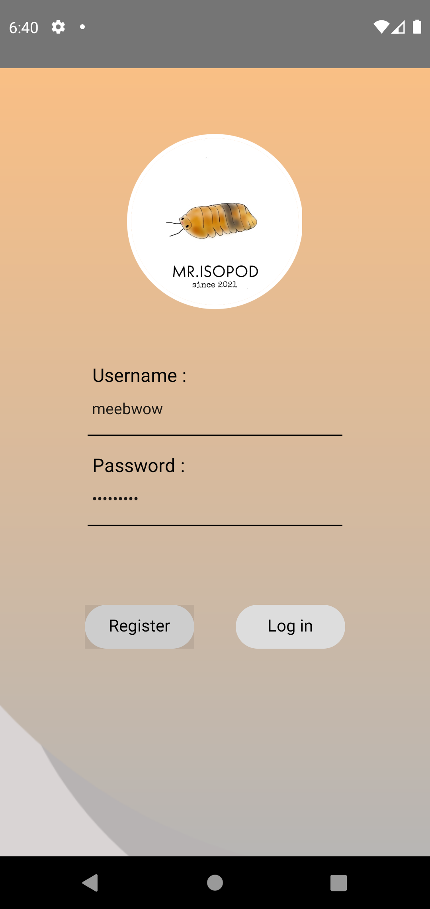

 • หน้านี้จะเป็นหน้า Register ของ Application 

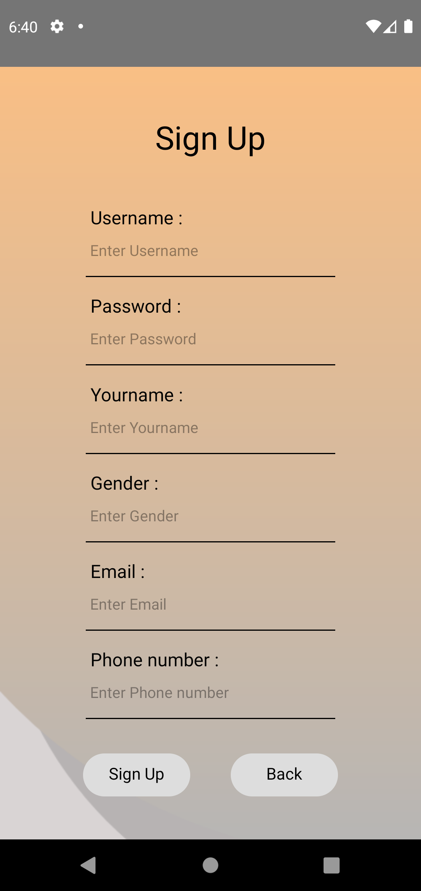

 • พอเราสมัครหรือลงเบียนเรียบร้อยแล้วก็ให้ทำการ Login  

 เข้ามาก็จะมาพบกับหน้า HomePage ก็จะเห็นได้ว่ามี Menu 4 อัน 

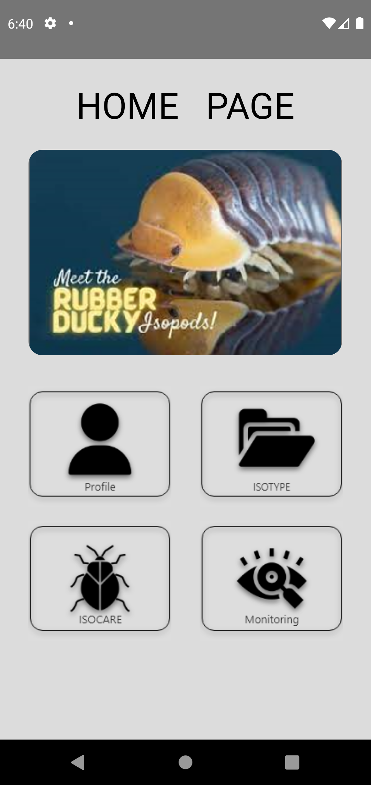

 • หน้านี่ก็จะทำการแสดงหน้า Profile ของเรานะครับ 

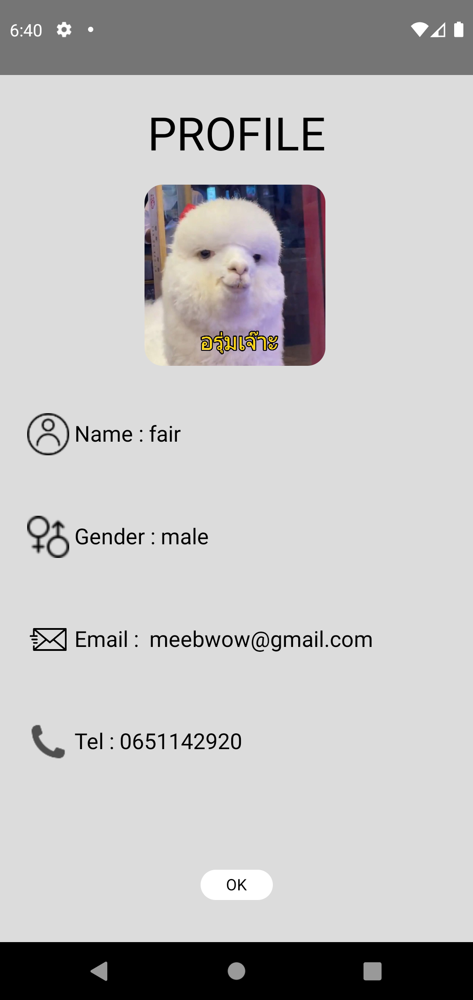

 • หน้านี้ก็จะแสดง Type Isopod ต่างๆนะครับ 

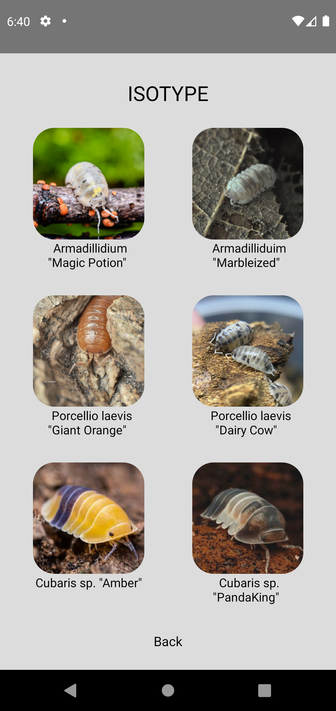

 • อันนี้จะเป็นตัวอย่างนะครับว่าพอเรากดเลือก Type แล้ว 

 ข้างในจะแสดงบอกข้อมูลอะไรบ้าง 

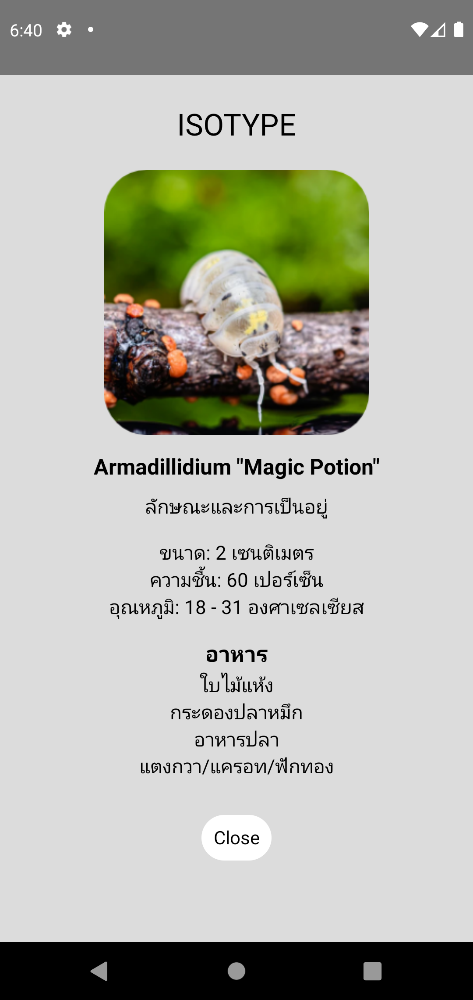

 • หน้า Isocare นี้จะแสดง Box ว่าเรามีทั้งหมดกี่ Box นะครับ 

 ที่ผมได้ทำไปจะมีอยู่ 3 Box ด้วยกัน แต่ละ Box ก็จะมีคนละ Type กัน 

 Hareware ของกลุ่มผมตอนนี้มีอยู่กล่องเดียวนั้นก็คือ Box ที่ 1 

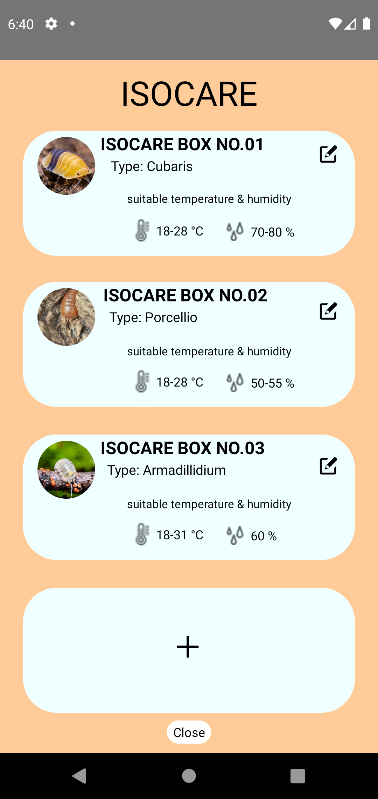

 • พอเรากดเลือก Box นั้นๆข้างในก็จะมีการโชว์ข้อมูลว่า 

 มีอะไรบ้าง มีการบอก Temp and Humid แล้วก็โชว์ออกมาเป็น Graph 

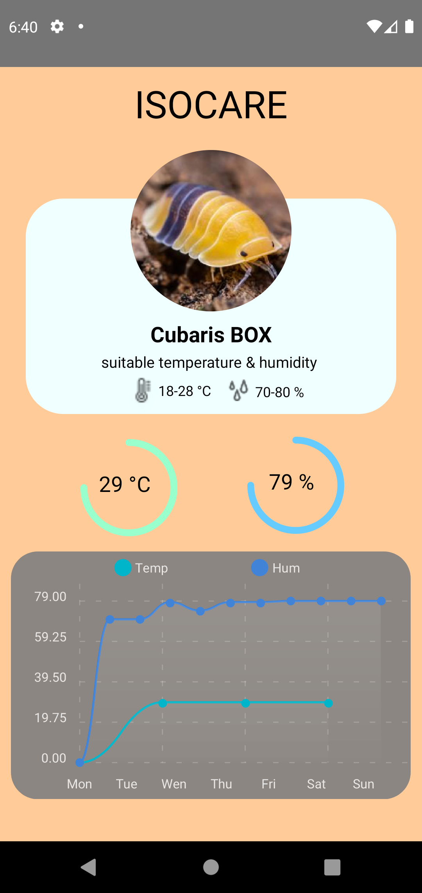

 • หน้านี้ก็จะเป็นการเขียน Data ไว้แยก Type แต่ละ Box 

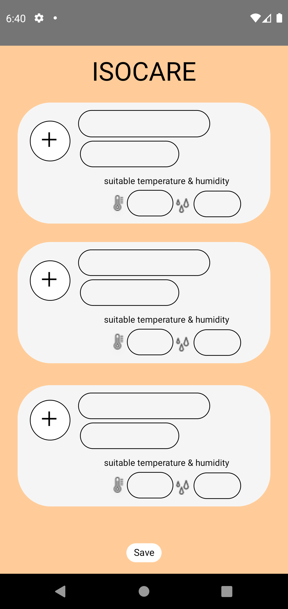

 • หน้านี้ก็เป็นหน้า Monitor เอาไว้สำหรับกรอกข้อมูลอัพเดท  

 การเจริญเติบโตของน้องๆนะครับ ก็จะมีให้กรอก Name, Size, Age, Other  

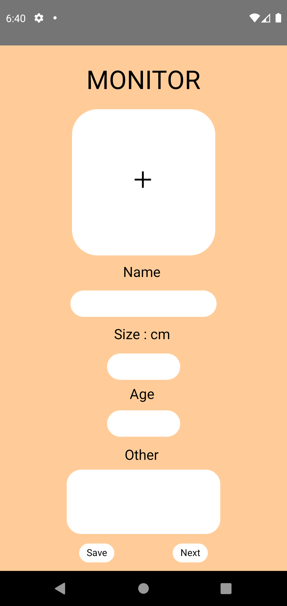

 • พอเราได้ทำการกรอกข้อมูลอัพเดทแล้วก็จะแบ่งออกแบ่ง Box นะครับ 

 เพราะว่าต้องแยก Type กันละ Type กัน 

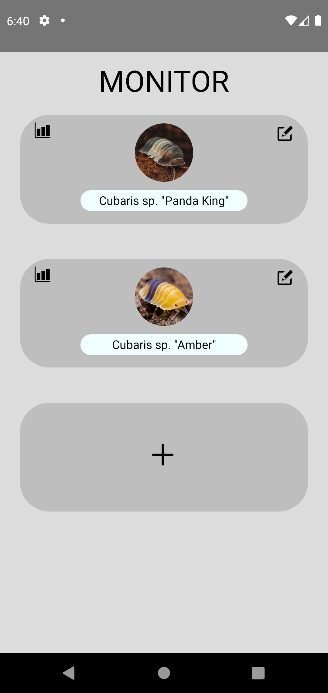

 • พอเรากดเลือก Box ที่เราจะดูข้างในก็จะเป็นการโชว์ข้อมูลที่เราได้ทำการ 

 กรอกอัพเดทการเจริญเติบโตเอาไว้นะครับนี้ก็จะเป็นตัวอย่างคร่าวๆให้รับชม 

 ที่จะเพิ่มเข้ามาหน้านี้ก็คือเป็นในส่วนของ Color นะครับก็จะบ่งบอกถึง Level นั้นๆว่า 

 สีของน้องๆอยู่สีไหนสวยไหม แข็งแรงไหมอะไรประมานนี้นะครับ 

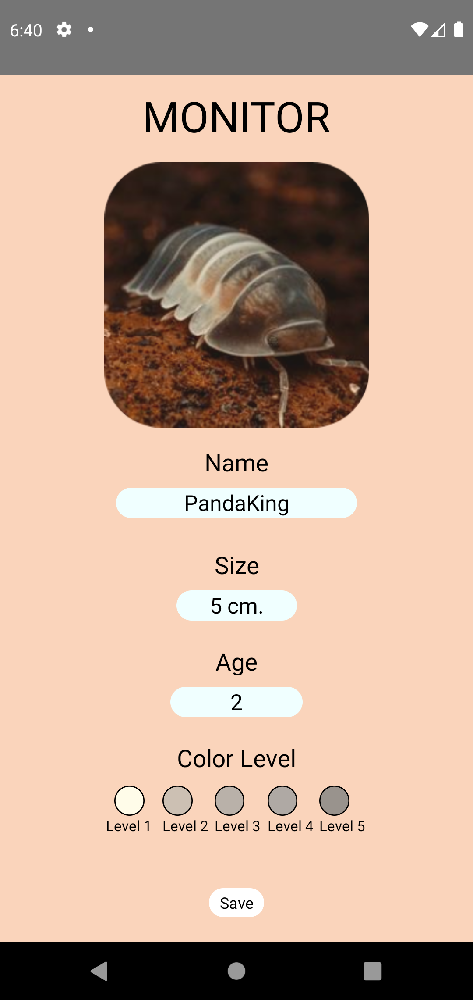

 • หน้านี้ก็จะเป็น Graph แสดงข้อมูลก็จะมีอยู่ 2 Graph นะครับ 

 Graph อันแรกจะแสดงข้อมูลเกี่ยวกับการเจริญเติบโตบ่งบอก ขนาด(Cm.) และก็ เป็นสัปดาห์(Week)

 Graph ที่สองจะแสดงสีของน้องๆว่าอยู่ Level ไหนอะไรประมานนี้ครับ 

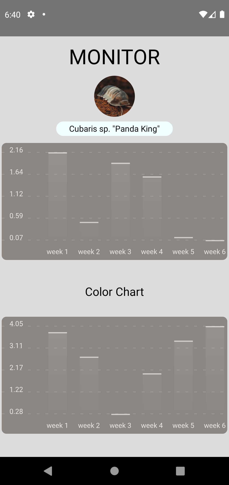
