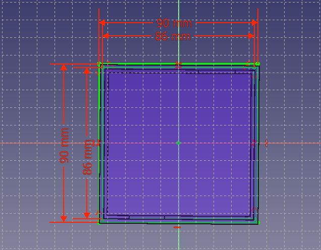
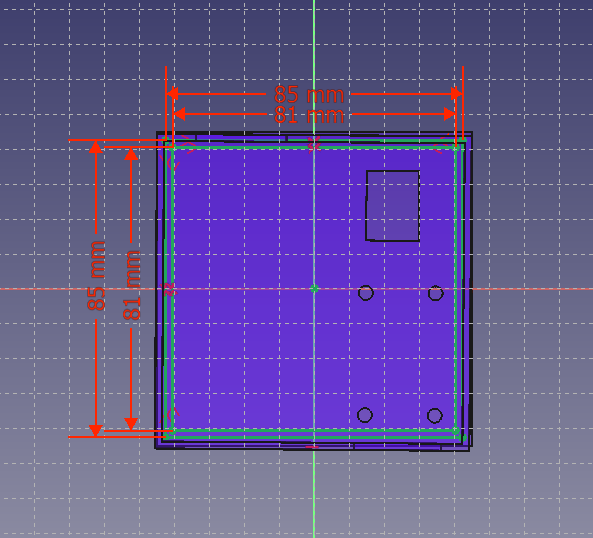

<h1>Isopod Hardware</h1>
<h3>อุปกรณ์ตัวกล่องวัดอุณหภูมิ</h3>

กล่องโฟมขนาดใหญ่

  

ขนาด 49.8*70.5*35.2 cm.
  
<a href="https://shopee.co.th/%E0%B8%81%E0%B8%A5%E0%B9%88%E0%B8%AD%E0%B8%87%E0%B9%82%E0%B8%9F%E0%B8%A1-Box-C-%E0%B8%82%E0%B8%99%E0%B8%B2%E0%B8%94%E0%B9%83%E0%B8%AB%E0%B8%8D%E0%B9%88-49.8*70.5*35.2-cm(%E0%B8%A3%E0%B8%9A%E0%B8%81%E0%B8%A7%E0%B8%99%E0%B8%AD%E0%B9%88%E0%B8%B2%E0%B8%99%E0%B8%A3%E0%B8%B2%E0%B8%A2%E0%B8%A5%E0%B8%B0%E0%B9%80%E0%B8%AD%E0%B8%B5%E0%B8%A2%E0%B8%94)-i.43007997.2737582565">Click here</a>  

FAN x2
  
  

ขนาด 12 cm.
  
<a href="https://shopee.co.th/NUBWO-%E0%B8%9E%E0%B8%B1%E0%B8%94%E0%B8%A5%E0%B8%A1%E0%B8%95%E0%B8%B4%E0%B8%94%E0%B9%80%E0%B8%84%E0%B8%AA-FAN-CASE-12cm-AIRFORCE-NFT-100-%E0%B8%A1%E0%B8%B5%E0%B8%AA%E0%B8%B5%E0%B9%80%E0%B8%82%E0%B8%B5%E0%B8%A2%E0%B8%A7-%E0%B9%81%E0%B8%94%E0%B8%87-%E0%B8%9F%E0%B9%89%E0%B8%B2-%E0%B8%82%E0%B8%B2%E0%B8%A7-i.31526847.1207404212?position=32">Click here</a>  

โมดูลจอแสดงผล LCD
 
   

ขนาด 5.5x2.3x1.4 cm.
 
<a href="https://www.cybertice.com/product/897/1602-lcd-blue-screen-16x2-%E0%B9%82%E0%B8%A1%E0%B8%94%E0%B8%B9%E0%B8%A5%E0%B8%88%E0%B8%AD%E0%B9%81%E0%B8%AA%E0%B8%94%E0%B8%87%E0%B8%9C%E0%B8%A5-lcd-%E0%B8%9E%E0%B8%A3%E0%B9%89%E0%B8%AD%E0%B8%A1-i2c-interface">Click here</a>    

Relay 5V 1Channel

ขนาด 50*25 mm.

<a href="https://www.cybertice.com/product/2872/%E0%B8%9A%E0%B8%AD%E0%B8%A3%E0%B9%8C%E0%B8%94-relay-1%E0%B8%8A%E0%B9%88%E0%B8%AD%E0%B8%87-5v-relay-module-5v-1-channel-isolation-high-and-low-trigger-250v-10a-2">Click here</a>

DHT22 โมดูลวัดอุณหภูมิและความชื้น

ขนาด 40*15 mm.

<a href="https://www.cybertice.com/product/697/dht22-am2302-module-%E0%B9%82%E0%B8%A1%E0%B8%94%E0%B8%B9%E0%B8%A5%E0%B8%A7%E0%B8%B1%E0%B8%94%E0%B8%AD%E0%B8%B8%E0%B8%93%E0%B8%AB%E0%B8%A0%E0%B8%B9%E0%B8%A1%E0%B8%B4%E0%B9%81%E0%B8%A5%E0%B8%B0%E0%B8%84%E0%B8%A7%E0%B8%B2%E0%B8%A1%E0%B8%8A%E0%B8%B7%E0%B9%89%E0%B8%99-temperature-and-humidity-sensor-module-%E0%B8%9E%E0%B8%A3%E0%B9%89%E0%B8%AD%E0%B8%A1%E0%B8%AA%E0%B8%B2%E0%B8%A2%E0%B9%84%E0%B8%9F">Click here</a>

ESP32 NodeMCU wifi

ขนาด 50*27 mm.

<a href="https://www.cybertice.com/product/1149/esp32-nodemcu-esp-wroom-32-wi-fi-and-bluetooth-module-dual-core-consumption?gclid=Cj0KCQjwnJaKBhDgARIsAHmvz6f2EW2hNV0SDm6gqHix8OR3cResC86y7AxX1qo4g25c2soJnG-7fEsaAizOEALw_wcB">Click here</a>

Switching Power supply 12V 10A

ขนาด 160*100*42 mm.

<a href="https://www.cybertice.com/product/560/switching-power-supply-%E0%B9%81%E0%B8%AB%E0%B8%A5%E0%B9%88%E0%B8%87%E0%B8%88%E0%B9%88%E0%B8%B2%E0%B8%A2%E0%B9%84%E0%B8%9F-%E0%B8%AA%E0%B8%A7%E0%B8%B4%E0%B8%95%E0%B8%8A%E0%B8%B4%E0%B9%88%E0%B8%87%E0%B9%80%E0%B8%9E%E0%B8%B2%E0%B9%80%E0%B8%A7%E0%B8%AD%E0%B8%A3%E0%B9%8C%E0%B8%8B%E0%B8%B1%E0%B8%9E%E0%B8%9E%E0%B8%A5%E0%B8%B2%E0%B8%A2-12v-10a">Click here</a>

ปั๊มน้ำขนาดเล็ก 5V

ขนาด 50*35 mm.

<a href="https://www.allnewstep.com/product/2250/%E0%B8%9B%E0%B8%B1%E0%B9%8A%E0%B8%A1%E0%B8%99%E0%B9%89%E0%B8%B3%E0%B8%82%E0%B8%99%E0%B8%B2%E0%B8%94%E0%B9%80%E0%B8%A5%E0%B9%87%E0%B8%81-3v-5v-dc-%E0%B9%81%E0%B8%99%E0%B8%A7%E0%B8%99%E0%B8%AD%E0%B8%99">Click here</a>

หัวพ่นหมอกเดี่ยวเสียบท่อ

ขนาด 5/7 mm.

<a href="https://www.thaiwatsadu.com/th/product/%E0%B8%AB%E0%B8%B1%E0%B8%A7%E0%B8%9E%E0%B9%88%E0%B8%99%E0%B8%AB%E0%B8%A1%E0%B8%AD%E0%B8%81%E0%B9%80%E0%B8%94%E0%B8%B5%E0%B9%88%E0%B8%A2%E0%B8%A7%E0%B9%80%E0%B8%AA%E0%B8%B5%E0%B8%A2%E0%B8%9A%E0%B8%97%E0%B9%88%E0%B8%AD-PE-%E0%B9%84%E0%B8%8A%E0%B9%82%E0%B8%A2%E0%B8%AA%E0%B8%9B%E0%B8%A3%E0%B8%B4%E0%B8%87%E0%B9%80%E0%B8%81%E0%B8%A5%E0%B8%AD%E0%B8%A3%E0%B9%8C-%E0%B8%A3%E0%B8%B8%E0%B9%88%E0%B8%99-374-1-%E0%B8%82%E0%B8%99%E0%B8%B2%E0%B8%94-5%7C7-%E0%B8%A1%E0%B8%A1-(%E0%B9%81%E0%B8%9E%E0%B9%87%E0%B8%84-5-%E0%B8%8A%E0%B8%B4%E0%B9%89%E0%B8%99)-%E0%B8%AA%E0%B8%B5%E0%B9%80%E0%B8%82%E0%B8%B5%E0%B8%A2%E0%B8%A7---%E0%B8%94%E0%B8%B3-60181231?gclid=Cj0KCQjwnJaKBhDgARIsAHmvz6dPjq4oVMfd3jo0dHK9tZ_DCPaJ1IKechDksrDBiSDwkMJM9iLtJu8aAnE1EALw_wcB">Click here</a>
<h3> Model example</h3>

ตัวอย่างการสร้างกล่องSwitching power supply

ภาพรวมชิ้นงานตอนประกอบ
  
  

ภาพรวมชิ้นงานด้านซ้าย
  
   

ภาพรวมชิ้นงานด้านหน้า
    
  
<h3>Resolution</h3> 

RESOLUTION BODY

   

ขนาด 163*103 mm.

RESOLUTION BODY1

 

ขนาด 159*99 mm.
  

RESOLUTION TOP
  
 

ขนาด 163*103 159*99 mm.
  

ตัวอย่างการสร้างกล่องใส่อุปกรณ์
  

ภาพรวมชิ้นงานตอนประกอบ
 

ภาพกล่องใส่อุปกรณ์โดยรวม

ด้านหน้ากล่อง

ด้านล่างกล่อง

  

<h3>Resolution</h3> 

RESOLUTION BODY

ขนาด 90*90 mm.
 

ขนาด 90*90 86*86 mm.
 

RESOLUTION TOP

ขนาด 90*90 mm.
 

ขนาด 90*90 85*81 mm.
 
 
<h3>BOX PRODUCT</h3>

ขนาด 710*510*353 mm.

  
